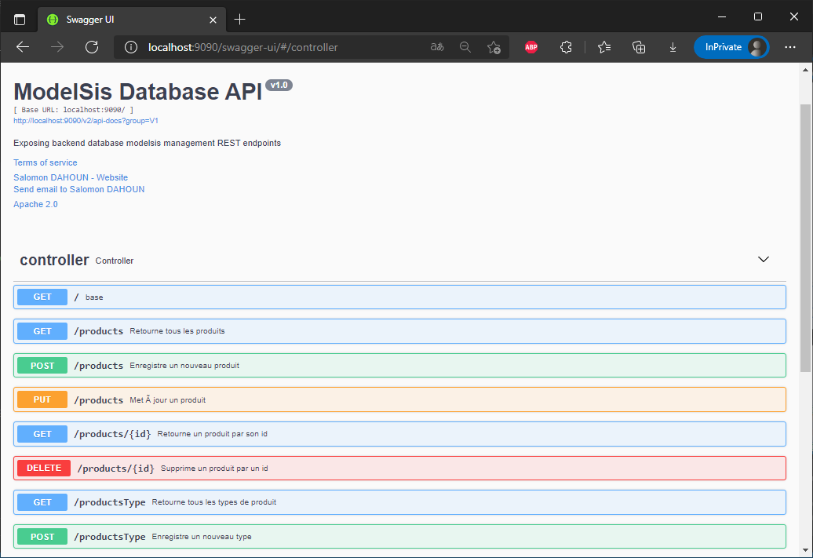

# Backend Application Programming Interface ModelSiS Database
The Backend Appplication Programming Interface ModelSiS Database is a backend application built with SpringBoot, a Java language framework. It exposes an API for accessing information from the PostgreSQL database. The API is documented with Swagger2. 
<!--
*** This project is the result of test at ModelSis
*** Author : Salomon DAHOUN
-->


<!-- PROJECT SHIELDS -->

[![Contributors][contributors-shield]][contributors-url]
[![Forks][forks-shield]][forks-url]
[![Stargazers][stars-shield]][stars-url]
[![Issues][issues-shield]][issues-url]
[![MIT License][license-shield]][license-url]
[![LinkedIn][linkedin-shield]][linkedin-url]


<!-- PROJECT LOGO -->
<br />
<p align="center">
  <a href="https://github.com/salomon-dhn/modelsis-springboot-fullstack">
    
  </a>

  <h3 align="center">Backend API ModelSis Database</h3>

  <p align="center">
    The Backend Appplication Programming Interface ModelSiS Database is a backend application built with SpringBoot, a Java language framework. It exposes an API for accessing information from the PostgreSQL database. The API is documented with Swagger2.
    <br />
    <a href="https://github.com/salomon-dhn/modelsis-springboot-fullstack"><strong>Explore the docs »</strong></a>
    <br />
    <br />
    <a href="https://modelsis.herokuapp.com/">View Demo</a>
    ·
    <a href="https://github.com/salomon-dhn/modelsis-springboot-fullstack/issues">Report Bug</a>
    ·
    <a href="https://github.com/salomon-dhn/modelsis-springboot-fullstack/pulls">Request Feature</a>
  </p>
</p>


<!-- TABLE OF CONTENTS -->
<details open="open">
  <summary><h2 style="display: inline-block">Table of Contents</h2></summary>
  <ol>
    <li>
      <a href="#about-the-project">About The Project</a>
      <ul>
        <li><a href="#built-with">Built With</a></li>
      </ul>
    </li>
    <li>
      <a href="#getting-started">Getting Started</a>
      <ul>
        <li><a href="#prerequisites">Prerequisites</a></li>
        <li><a href="#installation">Installation</a></li>
      </ul>
    </li>
    <li><a href="#usage">Usage</a></li>
    <li><a href="#roadmap">Roadmap</a></li>
    <li><a href="#contributing">Contributing</a></li>
    <li><a href="#license">License</a></li>
    <li><a href="#contact">Contact</a></li>
    <li><a href="#acknowledgements">Acknowledgements</a></li>
  </ol>
</details>


<!-- ABOUT THE PROJECT -->
## About The Project
The Backend Appplication Programming Interface ModelSiS Database is a backend application built with SpringBoot, a Java language framework. It exposes an API for accessing information from the PostgreSQL database. The API is documented with Swagger2.
    <br />
<br />
<p align="center">
<a align="center" href="https://github.com/salomon-dhn/modelsis-springboot-fullstack">
  
</a>
</p>

### Built With

* [SpringBoot](https://spring.io/projects/spring-boot)
* [Java 8](https://www.java.com/fr/)
* [Maven 3.2](https://maven.apache.org/index.html)
* [Postgres 14](https://www.postgresql.org/)
* [Lombok](https://projectlombok.org/)
* [Spring JPA](https://spring.io/projects/spring-data-jpa)
* [SLF4j](https://www.slf4j.org/)


<!-- GETTING STARTED -->
## Getting Started

To get a local copy up and running follow these simple steps.

### Prerequisites

* Have knowledge of Java 8, SpringBoot, Maven and the development environment with the IDE of your choice.

* Spring Tool Suite (STS) IDE or similar</br>
  It is necessary to have a Java IDE with at least Java version 8. You can download STS on their official download site : [STS Download page](https://spring.io/tools)

* Postgresql 14</br>
  Download Postresql 14 on official website : [PostgreSQL 14](https://www.postgresql.org/download/)


### Installation

1. Clone the repo
    ```sh
    git clone https://github.com/salomon-dhn/modelsis-springboot-fullstack.git
    ```
2. Install dependecies with Maven
    Update Project with the file "pom.xml".
    The dependencies will be downloaded.
3. Modify the database, username and password in "src/main/resources/application.propeties"
    ```sh
    ....
    spring.datasource.url=jdbc:postgresql://localhost:5432/database
    spring.datasource.username=username
    spring.datasource.password=password
    ....
    ```
4. Launch postgresql, check that the name of your database is created and that the user has the right to create a table.

5. Launch the "BackendApplication.java" 

6. Go to the browser and type :
    ```sh
    http://localhost:9090/swagger-ui/
    ``` 

Congratulation !!!


<!-- USAGE EXAMPLES -->
## Usage

You can try the application deployed on heroku : [https://modelsis.herokuapp.com/](https://zeco-afriq.herokuapp.com/)

_For more examples, please refer to the [Guides](https://spring.io/guides)_


<p align="right">(<a href="#top">back to top</a>)</p>

<!-- ROADMAP -->
## Roadmap

See the [open issues](https://github.com/salomon-dhn/modelsis-springboot-fullstack/issues) for a list of proposed features (and known issues).


<!-- CONTRIBUTING -->
## Contributing

Contributions are what make the open source community such an amazing place to be learn, inspire, and create. Any contributions you make are **greatly appreciated**.

1. Fork the Project
2. Create your Feature Branch (`git checkout -b feature/AmazingFeature`)
3. Commit your Changes (`git commit -m 'Add some AmazingFeature'`)
4. Push to the Branch (`git push origin feature/AmazingFeature`)
5. Open a Pull Request


<!-- LICENSE -->
## License

Distributed under the APACHE 2.0 License. See `LICENSE` for more information.


<!-- CONTACT -->
## Contact

LinkedIN : 
* [Salomon](https://www.linkedin.com/in/1sal)


Project Link: [https://github.com/salomon-dhn/modelsis-springboot-fullstack](https://github.com/salomon-dhn/modelsis-springboot-fullstack)


<!-- ACKNOWLEDGEMENTS -->
## Acknowledgements
- ModelSis

- Other :
    * [Heroku](https://heroku.com/)


<!-- MARKDOWN LINKS & IMAGES -->
<!-- https://www.markdownguide.org/basic-syntax/#reference-style-links -->
[contributors-shield]: https://img.shields.io/github/contributors/salomon-dhn/modelsis-springboot-fullstack.svg?style=for-the-badge
[contributors-url]: https://github.com/salomon-dhn/modelsis-springboot-fullstack/graphs/contributors
[forks-shield]: https://img.shields.io/github/forks/salomon-dhn/modelsis-springboot-fullstack.svg?style=for-the-badge
[forks-url]: https://github.com/salomon-dhn/modelsis-springboot-fullstack/network/members
[stars-shield]: https://img.shields.io/github/stars/salomon-dhn/modelsis-springboot-fullstack.svg?style=for-the-badge
[stars-url]: https://github.com/salomon-dhn/modelsis-springboot-fullstack/stargazers
[issues-shield]: https://img.shields.io/github/issues/salomon-dhn/modelsis-springboot-fullstack.svg?style=for-the-badge
[issues-url]: https://github.com/salomon-dhn/modelsis-springboot-fullstack/issues
[license-shield]: https://img.shields.io/github/license/salomon-dhn/modelsis-springboot-fullstack.svg?style=for-the-badge
[license-url]: https://github.com/salomon-dhn/modelsis-springboot-fullstack/tree/master/LICENSE
[linkedin-shield]: https://img.shields.io/badge/-LinkedIn-black.svg?style=for-the-badge&logo=linkedin&colorB=555
[linkedin-url]: https://github.com/salomon-dhn
[product-screenshot]: https://github.com/salomon-dhn/web-page/blob/main/assets/img/app.gif
